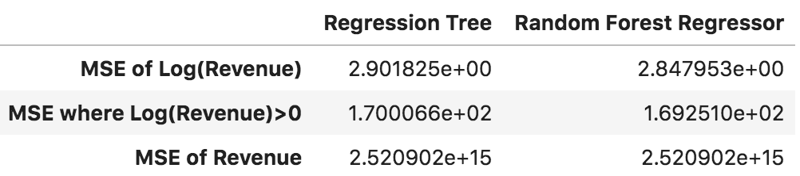

# Business Use Case: Customer Revenue Prediction on Google Store

### 1. Statement of Problem:

- An online retailer wants to strategically spend their marketing/advertising budget in order to drive web traffic that leads to revenue.

### 2. Client: 

- The data is published by Google for sales on their official Merchandise Store, but the procedure can be extrapolated to any online retailer using the Google Analytics web service.

### 3. Key Business Question:

- Can we identify whether a customer will make a purchase at a web store using Google Analytics web traffic data? 

### 4. Data Source:

- https://www.kaggle.com/c/ga-customer-revenue-prediction/data

### 5. Business Impact of Work:

- It is commonly said that 20% of customers generate 80% of the revenue (80/20 rule). If a business can focus their marketing efforts on this population of customers, the strategy will yield higher revenue while also becoming more efficient with their budget.

### 6. How business will use the statistical model:

- Goal is to provide an “out-of-box” solution for businesses to leverage ML on their Google Analytics data, which will enable them to focus marketing/advertising efforts.

- The model will determine whether any given web visitor will make purchase, which can be used to create targeted advertising lists (potentially by linking to Google Ads service)

- Model also automatically outputs top model predictors for revenue. This list will inform the business of their top audience and guide future advertising campaigns.

- Eliminates the need to manually interface with Google Analytics web platform

### 7. Metrics 

- Produce a confusion matrix of predictions vs true values, then extract metrics such as: Accuracy, Precision, True Positive Rate (TPR), False Positive Rate (FPR), F-Score.

# Methodology

### Feature Engineering 
	
- Most of the input data is categorical. Fields such as geographical location (city, country, continent, sub-continent, etc.), web browser, and device type have too many categories, with many of them only having a few occurrences in the data. Therefore, these low-frequency categorical levels were grouped by a minimum threshold (chosen arbitrarily by looking at counts); if a category has less than 100 occurrences, the observation was re-coded into a category called "Other".

- The response variable `totals.TransactionRevenue` is originally a continuous numeric dollar amount. For this project, I convert this variable into a binary response flag ('1' if Revenue is >0, '0' otherwise).

- All the categorical features were dummy encoded using `pandas.dummy_encode()` for use in sklearn. 

### Baseline Model 
	
- My baseline model is a simple regression tree with `max_depth = 5`. Currently I reserve 25% of the data as a validation set. 

### Updated Model

- The challenger model is a random forest regressor, using 10 estimatators and the same `max_depth = 5` parameter as in the previous model. 

### Results:

- Both the single regression tree and random forest model perform similary by assessing the Mean Squared Error (MSE) of log(Revenue). The random forest model performs slightly better in this regard, which I have shown side-by-side in the table below. 

-  

- **THE BUSINESS QUESTION** : In both cases, the log transformation must be undone to answer the business question: **can we predict revenue based on web traffic data?** In their current state, the models struggle to make accurate predictions on the dollar revenue amount, as evidenced by the extrordinarily high MSE (last row of MSE table). However, the input data can accurately predict the presence of a sale (True/False binary classification instead of revenue dollar prediction). Speficially, the `pageViews` column, which is an integer value representing how many page views a visitor accessed during a single web session, is highly predictive. 

-  

# Model Architecture

- Scoring is set up for streaming inputs (in dictionary format)

-  

# Input/Output Spec

- Input:
`{'channelGrouping': 'Organic Search',
 'visitNumber': 1,
 'device.browser': 'Firefox',
 'device.operatingSystem': 'Macintosh',
 'device.isMobile': False,
 'device.deviceCategory': 'desktop',
 'geoNetwork.continent': 'Oceania',
 'geoNetwork.subContinent': 'Australasia',
 'geoNetwork.country': 'Australia',
 'geoNetwork.region': 'not available in demo dataset',
 'geoNetwork.metro': 'not available in demo dataset',
 'geoNetwork.city': 'not available in demo dataset',
 'totals.transactionRevenue': False,
 'trafficSource.campaign': '(not set)',
 'trafficSource.source': 'google',
 'trafficSource.medium': 'organic',
 'trafficSource.adwordsClickInfo.page': np.nan,
 'trafficSource.adwordsClickInfo.slot': np.nan,
 'trafficSource.adwordsClickInfo.adNetworkType': np.nan,
 'trafficSource.adContent': np.nan}
`

- Output:
`{'Predicted to Make Purchase?' : bool(prediction)}`

# PyTest + Coverage Results

-  
-  