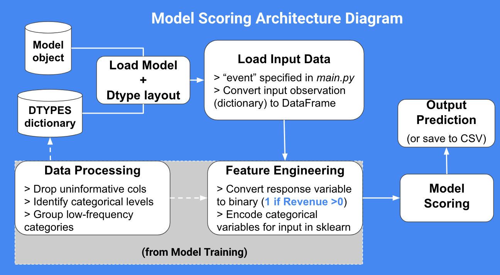

# Google Analytics Customer Purchase Prediction

### 1. Statement of Problem:

- An online retailer wants to strategically spend their marketing/advertising budget in order to drive web traffic that leads to revenue. Through Google Analytics, they have a basic understanding of their target audience, but is this the best the business can do?

### 2. Client: 

- The data is published by Google for sales on their official Merchandise Store, but the procedure can be extrapolated to any online retailer using the Google Analytics web service.

### 3. Key Business Question:

- Can we identify whether a customer will make a purchase at a web store using Google Analytics web traffic data? 

### 4. Data Source:

- https://www.kaggle.com/c/ga-customer-revenue-prediction/data

### 5. Business Impact of Work:

- Suppose model insights lead to 20% increase in conversion rate (1.5% → 1.8%, using values from the dataset) 
	- (AVG $ per sale) x (monthly visits) x (% of visits with sale) = Monthly Revenue
	- Assuming avg. $50 per sale, 70,000 monthly visits: Monthly revenue increases by $10,500, or over $125,000 additional revenue generated per year!

### 6. How business will use the statistical model:

- Goal is to provide an “out-of-box” solution for businesses to leverage ML on their Google Analytics data, which will enable them to focus marketing/advertising efforts.

- The model will determine whether any given web visitor will make purchase, which can be used to create targeted advertising lists (potentially by linking to Google Ads service)

- Automatically output top model predictors for revenue. This list will inform the business of their top audience and guide future advertising campaigns

- Eliminates the need to manually interface with Google Analytics web platform

- Ultimately, these predictions will enable the business to focus marketing/advertising efforts based on these predictions

### 7. Metrics 

- Produce a confusion matrix of predictions vs true values, then extract metrics such as: Accuracy, Precision, True Positive Rate (TPR), False Positive Rate (FPR), AUC.

# Methodology

### Data Preprocessing

- The data from Kaggle comes in a CSV, but some JSON fields exist which must be parsed. I borrowed the JSON flattening code from Kaggle user [julian3833](https://www.kaggle.com/julian3833/1-quick-start-read-csv-and-flatten-json-fields) 

- I drop uninformative columns, which include: fields with only 1 distinct value, fields with only distinct values (such as unique strings and index columns).

- I also drop future-looking columns to avoid leakage, such as the number of PageViews during a web session (in a real situation, we want to make a prediction before the visitor interacts with the site).

### Feature Engineering 
	
- Most of the input data is categorical. Fields such as geographical location (city, country, continent, sub-continent, etc.), web browser, and device type have too many categories, with many of them only having a few occurrences in the data. Therefore, these low-frequency categorical levels were grouped by a minimum threshold (chosen arbitrarily by looking at counts); if a category has less than 100 occurrences, the observation was re-coded into a category called "Other".

- The response variable `totals.TransactionRevenue` is originally a continuous numeric dollar amount. For this project, I convert this variable into a binary response flag ('1' if Revenue is >0, '0' otherwise).

- All the categorical features were dummy encoded using `pandas.dummy_encode()` for use in sklearn. Missing values are handled by being treated as their own categorical level.

### Model Training
	
- The final model is a random forest classifer, or an ensemble method which aggregates classification results from a series of decision trees.

- I trained the model on 80% of the available data, reserving 20% of the data as a validation set.

- In Python/scikit-learn, the model utilized the following parameters:

	- `RandomForestClassifier(n_estimators=50, 
                       max_depth=10,random_state=42,
                       class_weight='balanced',
                       n_jobs=4)
		`

- Once the model is trained, the top predictors can be extracted from the sklearn model object. 

### Model Performance

Here are the top 10 predictors of purchase for the Google Merchandise Store:

- The top 3 predictors are all related to Geographic region, particularly to visitors from the U.S. (`geoNetwork.country_United States`) I used these top features to manually create a decision rule (i.e. predict as 'Pruchase' if visitor is from the U.S, 'No Purchase' otherwise). This method will serve as the baseline "model".

Using the trained model, I used the remaining 20% of testing data to evaluate the model performance:

- The confusion matrix, with the rows indicating true classes, and columns indicating predicted classes:

	- 

- The perfoamnce metrics, including: True Postiive Rate (TPR), False Positive Rate (FPR), Precision, AUC, and Accuracy

	- 

# Results:

- The random forest classifier achieves a very important result: It captures purchasers with much higher precision than the baseline audience. 

	- Traditional digital advertising strategies work by "casting a wide net" over the target audience (simulated by baseline approach of targeting only U.S. visitors). 

	- On the other hand, the random forest model carefully selects the target audience based on all their web traffic characteristics.

- The detailed targeting by this model can directly translate into financial gains through:

	- Increased conversion rate: the visitors reaching the website will be more likely to make a purchase

		- This involves use of the top predictors list to inform future marketing campaigns

	- Reduced cost basis for marketing/advertising with fewer people being targeted who will never make a purchase, there will be budget savings in terms of cost-per-click (CPC), cost-per-action (CPA), etc.

- Other possible uses for these results include:

	- Linking Google Analytics directly to Google Ads service, then building a targeted advertisement list using Visitor ID (from Google Analytics input data)

	- Dynamic advertising strategies: Take advantage of Google's big data platform (BigQuery) to stream input data directly to the model and make live predicitons

# Model Architecture

- Scoring is set up for streaming inputs (in dictionary format)

-  

# Input/Output Spec

- Input:
`{'channelGrouping': 'Organic Search',
 'visitNumber': 1,
 'device.browser': 'Firefox',
 'device.operatingSystem': 'Macintosh',
 'device.isMobile': False,
 'device.deviceCategory': 'desktop',
 'geoNetwork.continent': 'Oceania',
 'geoNetwork.subContinent': 'Australasia',
 'geoNetwork.country': 'Australia',
 'geoNetwork.region': 'not available in demo dataset',
 'geoNetwork.metro': 'not available in demo dataset',
 'geoNetwork.city': 'not available in demo dataset',
 'totals.transactionRevenue': False,
 'trafficSource.campaign': '(not set)',
 'trafficSource.source': 'google',
 'trafficSource.medium': 'organic',
 'trafficSource.adwordsClickInfo.page': np.nan,
 'trafficSource.adwordsClickInfo.slot': np.nan,
 'trafficSource.adwordsClickInfo.adNetworkType': np.nan,
 'trafficSource.adContent': np.nan}
`

- Output:
`{'Predicted to Make Purchase?' : bool(prediction)}`

# Instructions for Running the Model:

Model was developed and tested with the following installations:

	- `Python 3.8.5` 

	- `conda version : 4.5.11`

	- `Mac OS X 10.11.6 (El Capitan)`

	- The specific package versions can be found in `requirements.txt`

The Steps to running the model are outlined below:

	- Clone Repository, then navigate to the root level. 

	- Open `main.py` and edit the `SAMPLE_OBS` variable to input a custom dictionary object, following the input specs format.

	- Save the program, then run in command line with `python main.py`

	- The output of this program will be a print-out on the terminal/console which follows the output spec layout.

# PyTest + Coverage Results

-  
-  